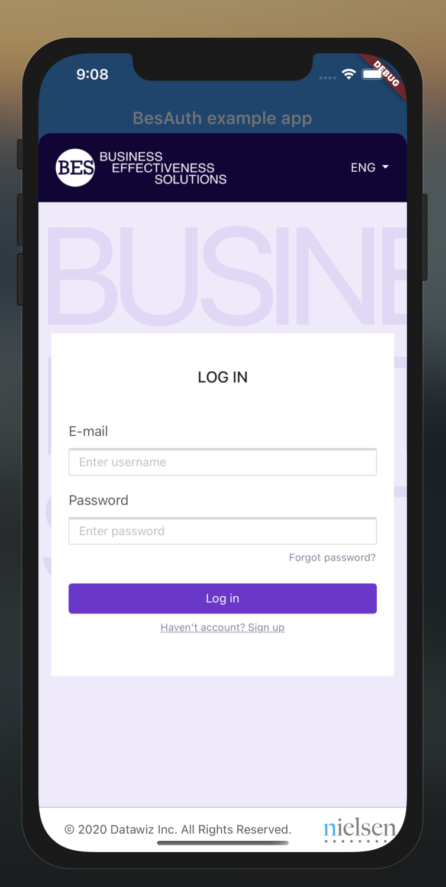

<h1 align="center">flutter_bes_auth</h1>

<h6 align="center">
 Plugin for simple integration with "BES" authorization.
</h6>

<p align="center">
  
</p>

# Simple Auth Example

```dart
void main() async {
  BesAuth besAuth = BesAuth(
    serviceUrl: "YOURE",
    redirectPath: "YOURE_REDIRECT_PATH",
    clientId: "YOURE_CLIENT_ID",
    clientSecret: "YOURE_CLIENT_SECRET",
  );
  
  BesSession session = await besAuth.authenticate();

  print(session); // {scope: "SCOPE", expires_in: "EXPIRES_IN", token_type: "TOKEN_TYPE", access_token: "ACCESS_TOKEN", refresh_token: "REFRESH_TOKEN"}
}
```

# Flutter Example

```dart
import 'package:flutter/material.dart';
import 'package:flutter_bes_auth/flutter_bes_auth.dart';

BesAuth besAuth = BesAuth(
  serviceUrl: "YOURE",
  redirectPath: "YOURE_REDIRECT_PATH",
  clientId: "YOURE_CLIENT_ID",
  clientSecret: "YOURE_CLIENT_SECRET",
);

void main() {
  runApp(MyApp());
}

class MyApp extends StatelessWidget {
  const MyApp({Key key}) : super(key: key);

  @override
  Widget build(BuildContext context) {
    return MaterialApp(
      theme: ThemeData(
        primarySwatch: Colors.blue,
        visualDensity: VisualDensity.adaptivePlatformDensity,
      ),
      home: LoginPage(),
    );
  }
}

class LoginPage extends StatefulWidget {
  @override
  _LoginPageState createState() => _LoginPageState();
}

class _LoginPageState extends State<LoginPage> {
  BesSession _session;

  void _handleAuthificate(BuildContext context) async {
    BesSession nextSession = await besAuth.authenticate(context);
    setState(() => _session = nextSession);
  }

  void _handleLogout() async {
    await besAuth.logout(_session);
    setState(() => _session = null);
  }

  @override
  Widget build(BuildContext context) {
    return Scaffold(
      appBar: AppBar(
        title: const Text('BesAuth example app'),
      ),
      body: Center(
        child: Row(
          mainAxisAlignment: MainAxisAlignment.center,
          children: [
            RaisedButton(
              child: Text("Authificate"),
              onPressed: () => _handleAuthificate(context),
            ),
            SizedBox(
              width: 50,
            ),
            RaisedButton(
              child: Text("Logout"),
              onPressed: _handleLogout,
            ),
          ],
        ),
      ),
    );
  }
}

```
